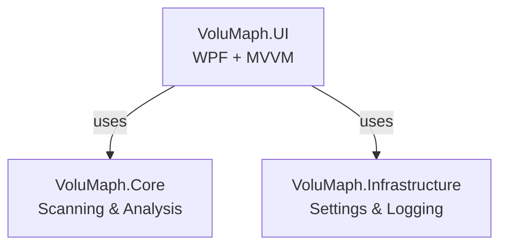

# 📊 VoluMaph

**Fast disk usage visualization for Windows**

[](https://github.com/tyonishi/volumaph/actions)
[](https://opensource.org/licenses/MIT)
[](https://dotnet.microsoft.com/download/dotnet/8.0)

## 📖 About

VoluMaph (Volume + Map) is a lightweight, high-performance disk usage visualization tool for Windows 10/11. It scans your disk and visualizes folder structures to help you identify space-hungry files and directories quickly.

Inspired by tools like WinTree, VoluMaph focuses on:
- **Fast scanning** - Optimized for performance with large directories
- **Simple UI** - Clean, intuitive interface
- **Modern design** - Windows 11 Fluent Design inspired
- **No dependencies** - Built with .NET SDK only

## ✨ Features

### Current Features (Implemented)

#### Core Scanning & Analysis
- ✅ **Disk Scanning** - Scan any drive or folder with async operations
- ✅ **Real-time Progress** - Live scan progress updates with cancellation support
- ✅ **Size Aggregation** - Automatic recursive size calculation for folders
- ✅ **File/Folder Counting** - Accurate file and folder statistics
- ✅ **Duplicate Detection** - Find duplicates by size and by SHA-256 hash
- ✅ **Extension Analysis** - Analyze file type distribution with statistics

#### Filtering & Sorting
- ✅ **Advanced Filtering** - Filter by size range, extension, and file age
- ✅ **Date Filtering** - Filter by creation/modification date
- ✅ **Search** - Real-time case-insensitive search by name
- ✅ **Multiple Sorting Options** - Sort by size, name, or file count (ascending/descending)
- ✅ **Extension Filter** - Filter by specific file extensions

#### UI/UX
- ✅ **Tree View** - Visual folder hierarchy with icons and size display
- ✅ **Data Grid** - Sortable columns with context menu
- ✅ **Drag & Drop** - Scan folders by dragging them onto the window
- ✅ **Theme Support** - Dark/Light/High Contrast themes
- ✅ **Fluent Design** - Modern Windows 11 inspired UI with animations
- ✅ **Summary Cards** - Quick overview of total size, files, folders, largest file
- ✅ **Expandable Panels** - Collapsible summary and filter panels
- ✅ **Toast Notifications** - Non-intrusive status messages
- ✅ **Context Menus** - Right-click options for file operations
- ✅ **Keyboard Shortcuts** - F5 (refresh), Escape (cancel), Ctrl+E (CSV), Ctrl+T (theme)

#### Export & Operations
- ✅ **CSV Export** - UTF-8 with BOM for Excel compatibility
- ✅ **HTML Export** - Styled reports with CSS and responsive design
- ✅ **Open in Explorer** - Navigate to selected file/folder
- ✅ **Copy Path/Name** - Quick copy to clipboard
- ✅ **Screenshot** - Capture current view

### Planned Features
- 🔲 **Treemap Visualization** - Rectangular space visualization
- 🔲 **NTFS MFT Scanning** - Ultra-fast scan mode
- 🔲 **File Operations** - Delete files directly from UI
- 🔲 **Sunburst Chart** - Circular hierarchical visualization
- 🔲 **Interactive Zooming** - Navigate large datasets more efficiently

## 📸 Screenshots

> *Screenshots coming soon!*

## 🚀 Getting Started

### Prerequisites

- **Windows 10** (version 1809 or later) or **Windows 11**
- **.NET 8.0 SDK** - [Download here](https://dotnet.microsoft.com/download/dotnet/8.0)
- Visual Studio 2022 (optional) or VS Code

### Installation

#### From Source

```bash
# Clone the repository
git clone https://github.com/tyonishi/volumaph.git
cd volumaph

# Build the solution
dotnet build

# Run the application
dotnet run --project src/VoluMaph.UI
```

#### Release Build

```bash
# Create a self-contained executable
dotnet publish src/VoluMaph.UI -c Release -r win-x64 --self-contained true
```

The executable will be in `src/VoluMaph.UI/bin/Release/net8.0-windows/win-x64/publish/`

## 📖 Usage

### Basic Usage

1. **Select Drive** - Choose a drive from the dropdown
2. **Click Scan** - Start scanning the selected drive
3. **Explore** - Navigate the folder tree in the left panel
4. **View Details** - See detailed file information in the right panel
5. **Filter & Sort** - Use the toolbar to filter and sort results

### Keyboard Shortcuts

| Shortcut | Action |
|----------|--------|
| `Ctrl+R` | Refresh drive list |
| `F5` | Re-scan current drive |
| `Ctrl+E` | Export to CSV |
| `Ctrl+H` | Export to HTML |

### Advanced Features

#### Filtering
Filter files by:
- **Size range** - Min/Max size in bytes
- **File extensions** - `.txt`, `.png`, etc.
- **Date modified** - Files modified after/before X days
- **Date created** - Files created after/before X days

#### Sorting
Sort folders and files by:
- Size (ascending/descending)
- Name (ascending/descending)
- File count

#### Export
Export scan results to:
- **CSV** - For spreadsheet analysis
- **HTML** - For formatted reports with styling

## 🔧 Development

### Project Structure

```
volumaph/
 ├─ src/
 │   ├─ VoluMaph.Core/          # Core logic (scanning, models, analysis)
 │   │   ├─ Analysis/            # Size aggregation, filtering, sorting
 │   │   ├─ Model/               # File system node models
 │   │   └─ Scanning/            # Scanner implementations
 │   ├─ VoluMaph.Infrastructure/ # Settings, logging
 │   │   ├─ Logging/
 │   │   └─ Settings/
 │   └─ VoluMaph.UI/            # WPF UI + MVVM
 │       ├─ Commands/           # Command implementations
 │       ├─ Themes/              # Dark/Light theme resources
 │       ├─ ValueConverters/     # Data binding converters
 │       └─ ViewModels/          # MVVM ViewModels
 ├─ tests/                      # Unit tests
 ├─ docs/                       # Documentation
 └── AGENTS.md                   # Agent development rules
```

### Building

```bash
# Build entire solution
dotnet build

# Build specific project
dotnet build src/VoluMaph.Core

# Clean build
dotnet clean && dotnet build
```

### Testing

```bash
# Run all tests
dotnet test

# Run tests for specific project
dotnet test tests/VoluMaph.Core.Tests
dotnet test tests/VoluMaph.UI.Tests

# Run tests with detailed output
dotnet test --logger "console;verbosity=detailed"

# Run tests with coverage (requires coverlet)
dotnet test --collect:"XPlat Code Coverage"
```

**Test Coverage:**
- **VoluMaph.Core**: 34 tests covering models, scanning, and analysis
- **VoluMaph.UI**: 35 tests covering ViewModels and exports
- **Total**: 69 tests across all modules
- **Coverage Areas**: File/Folder models, DirectoryScanner, FolderAnalyzer, ExtensionAnalyzer, DuplicateDetector, MainViewModel, Export functionality

### Code Style

We follow these conventions:
- **PascalCase** for classes, methods, properties
- **_camelCase** for private fields
- **camelCase** for local variables
- No unnecessary comments
- Single space indentation
- Newline at end of file

See [AGENTS.md](AGENTS.md) for detailed coding standards.

### Architecture

VoluMaph follows a clean architecture with three main layers:



**Key Principles:**
- **Loose Coupling** - Core logic independent of UI
- **CQRS** - Separation of read (scanning) and write (UI updates)
- **Async/Await** - All file operations are asynchronous
- **MVVM** - UI uses Model-View-ViewModel pattern

## 🗺️ Roadmap

### ✅ Phase 1: MVP (Complete)
- Basic disk scanning
- Tree view display
- Size aggregation
- UI framework
- Basic filtering and sorting
- Export to CSV/HTML
- Theme support

### 🔨 Phase 2: Advanced Analysis (Complete)
- Duplicate file detection (by size and hash)
- Extension analysis with statistics
- Advanced date filtering
- File age analysis
- Comprehensive test coverage (69 tests)

### ✅ Phase 3: Fluent Design UI/UX (Complete)
- Color system and typography
- Button styles (Primary, Secondary, Icon)
- Segoe MDL2 icon system
- Toolbar restructure (4 groups)
- Split panes with GridSplitter
- Summary panel and filter panel
- DataGrid styling (header sort indicators)
- TreeView styling (icons, expand/collapse animations)
- Enhanced progress bar (shimmer animation, time estimate, file count)
- ComboBox, TextBox, Expander styles
- Micro-interactions (hover/press effects)
- Accessibility properties (AutomationProperties, focus indicators)
- Cancel button, tooltips, enhanced keyboard navigation
- Toast notifications
- Context menu
- Drag & drop
- Screenshot

### 🔮 Phase 4: Advanced Visualization (Planned)
- Treemap view
- Size-based color coding
- Sunburst chart
- Interactive zooming

### 🚀 Phase 5: Advanced Features (Planned)
- NTFS MFT fast scan
- File deletion from UI
- Bookmark favorite folders
- Search across entire scan

## 🤝 Contributing

Contributions are welcome! Please see [CONTRIBUTING.md](CONTRIBUTING.md) for guidelines.

### Quick Start for Contributors

1. Fork the repository
2. Create a feature branch (`git checkout -b feature/amazing-feature`)
3. Make your changes
4. Add tests for new functionality
5. Ensure all tests pass (`dotnet test`)
6. Commit with clear messages
7. Push to your fork
8. Open a Pull Request

## 🐛 Reporting Issues

Found a bug? Please [open an issue](https://github.com/tyonishi/volumaph/issues/new?template=bug_report.md) with:
- Clear description of the problem
- Steps to reproduce
- Expected vs actual behavior
- Screenshots if applicable
- Your environment (OS, .NET version)

## 💡 Feature Requests

Have an idea? Please [open an issue](https://github.com/tyonishi/volumaph/issues/new?template=feature_request.md) with:
- Clear description of the feature
- Use case and benefits
- Possible implementation approach (if known)

## 📄 License

This project is licensed under the MIT License - see the [LICENSE](LICENSE) file for details.

## 🙏 Acknowledgments

- Inspired by [WinTree](https://antibody-software.com/wiztree/) for the concept of fast disk scanning
- Built with [WPF](https://docs.microsoft.com/en-us/dotnet/desktop/wpf/) and [.NET 8](https://dotnet.microsoft.com/)
- MVVM pattern implementation
- Icons from [Fluent UI System Icons](https://github.com/microsoft/fluentui-system-icons)

## 📞 Support

- 📧 Email: support@capricornus.biz
- 💬 Discussions: [GitHub Discussions](https://github.com/tyonishi/volumaph/discussions)
- 📖 Documentation: [docs/](docs/)
- 🐛 Issues: [GitHub Issues](https://github.com/tyonishi/volumaph/issues)

## 🌟 Star History

<a href="https://star-history.com/#tyonishi/volumaph&Date">
  <picture>
    <source media="(prefers-color-scheme: dark)" src="https://api.star-history.com/svg?repos=tyonishi/volumaph&type=Date&theme=dark" />
    <source media="(prefers-color-scheme: light)" src="https://api.star-history.com/svg?repos=tyonishi/volumaph&type=Date" />
    
  </picture>
</a>

---

Made with ❤️ by the VoluMaph team
