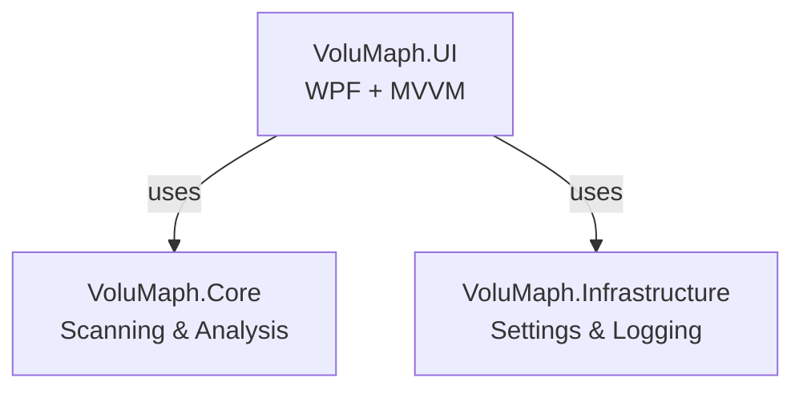

# 📘 VoluMaph Design Document

---

## 1. Project Overview

### 1.1 App Name
**VoluMaph**
(Portmanteau of Volume + Map. A Windows application for high-speed disk usage visualization)

### 1.2 Development Language / Framework
- **C# / .NET 8**
- **UI：WPF** (Focus on lightweight performance and Windows affinity)
- **Target OS：Windows 10 / 11**

### 1.3 App Purpose
- Rapidly scan disk usage on a PC and **visually map folder structures**.
- Aim for WizTree-like performance while providing a **lightweight, simple, modern UI**.

---

## 2. Functional Requirements

### 2.1 Core Features

#### Disk Scanning ✅ Implemented
- Retrieve capacity/usage of specified drives
- Aggregate sizes by folder hierarchy
- Display scan progress
- Asynchronous scanning (no UI blocking)
- Cancellation support
- Drag & drop folder scanning

#### High-Speed Scan Mode 🔲 Not Implemented
- High-speed scan by directly reading NTFS MFT (future implementation)
- Normal scan (DirectoryInfo-based)

#### Visualization ✅ Implemented
- TreeView display (Fluent Design, Segoe MDL2 icons)
- Display size and percentage per folder
- DataGrid display (sortable, with header sort indicators)
- Summary cards (statistics: total size, file count, folder count, largest file)
- Treemap (rectangular partition) display (future implementation)

#### Search & Filtering ✅ Implemented
- Folder/file name search (real-time, case-insensitive)
- Size range filter
- Extension filter
- Date filter (creation date / modification date)
- Sort (size, name, file count - ascending/descending)

#### Duplicate File Detection ✅ Implemented
- Detect duplicate candidates by size
- Detect exact matches by SHA-256 hash

#### Extension Analysis ✅ Implemented
- Aggregate usage by extension
- File count statistics
- Percentage display

#### Export ✅ Implemented
- CSV export (UTF-8 BOM support)
- HTML export (styled reports)
- Screenshot functionality

---

## 3. Non-Functional Requirements

### 3.1 Performance
- Operate smoothly even with 1 million files
- Optimize scan speed using Windows APIs

### 3.2 UI/UX
- Simple and lightweight
- Align with Windows 11 Fluent Design
- Support for Dark/Light/High Contrast themes
- Accessibility support (AutomationProperties, focus indicators)

### 3.3 Extensibility
- Structure prepared for plugin architecture (future)
- Decouple scan engine and UI

---

## 4. Architecture Design

### 4.1 Overall Structure
```
VoluMaph
 ├─ Core (Scan・Model・Analysis) ✅ Implemented
  │   ├─ Model/
  │   │   ├── FileSystemNode.cs
  │   │   ├── FileNode.cs
  │   │   ├── FolderNode.cs
  │   │   └── DiskUsageSummary.cs
  │   ├─ Scanning/
  │   │   ├── IScanner.cs
  │   │   ├── ScanProgress.cs
  │   │   └── DirectoryScanner.cs
  │   └─ Analysis/
  │       ├── IFolderAnalyzer.cs
  │       ├── FolderAnalyzer.cs
  │       ├── IExtensionAnalyzer.cs
  │       ├── ExtensionAnalyzer.cs
  │       ├── IDuplicateDetector.cs
  │       └── DuplicateDetector.cs
 ├─ Infrastructure (Settings・Logging) ✅ Implemented
  │   ├─ Logging/
  │   │   ├── ILogger.cs
  │   │   └── SimpleLogger.cs
  │   └─ Settings/
  │       ├── AppSettings.cs
  │       ├── ISettingsProvider.cs
  │       └─ JsonSettingsProvider.cs
 └─ UI (WPF + MVVM) ✅ Implemented
     ├─ ViewModels/
     │   ├── ViewModelBase.cs
     │   └── MainViewModel.cs
     ├─ Commands/
     │   ├── RelayCommand.cs
     │   └─ AsyncRelayCommand.cs
     ├─ Controls/
     │   ├── SpinnerControl.xaml/cs
     │   ├── SummaryCard.xaml/cs
     │   └─ ToastNotification.xaml/cs
     ├─ ValueConverters/
     │   ├── SizeToHumanReadableConverter.cs
     │   ├── SizeToColorConverter.cs
     │   ├── IconConverter.cs
     │   ├── CountToBoolConverter.cs
     │   └─ BoolToVisibilityConverter.cs
     ├─ Themes/
     │   ├── DarkTheme.xaml
     │   ├── LightTheme.xaml
     │   ├── HighContrastTheme.xaml
     │   ├── Colors.xaml
     │   ├── DesignSystem.xaml
     │   ├── Typography.xaml
     │   └─ Styles/ (Buttons, Grid, Tree, ComboBox, TextBox, Expander, ProgressBar)
     └─ MainWindow.xaml/cs
```

### 4.2 Layer Structure Diagram



---

## 5. Data Flow

```
[User selects drive]
        ↓
[Scanner] → Get file list
        ↓
[Analyzer] → Aggregate size / Sort
        ↓
[FileSystemModel] → Organize into hierarchy
        ↓
[UI] → Display in TreeView / DataGrid
```

---

## 6. Screen Design (Simplified)

### 6.1 Main Screen ✅ Implemented

#### Top Toolbar
- Drive selection ComboBox
- Scan/Refresh/Cancel buttons
- Search box
- Filter toggle button (show active filters)
- Theme toggle button
- CSV/HTML export buttons
- Screenshot button

#### Summary Panel (Expandable)
- Total size
- Total file count
- Total folder count
- Largest file (size and name)

#### Filter Panel (Expandable)
- Minimum size / Maximum size
- Extension filter
- Modified date filter
- Created date filter

#### Main Area
- Left: Folder TreeView (Fluent Design, with Segoe MDL2 icons)
- Right: DataGrid (sortable, context menu, header sort indicators)
- Width adjustable with GridSplitter

#### Bottom Status Bar
- Status message
- Progress bar (shimmer animation, time estimate, file count)

### 6.2 Operation Features ✅ Implemented
- Keyboard shortcuts (F5, Escape, Ctrl+E, Ctrl+T, Ctrl+F)
- Context menu (Open in Explorer, Copy path/name, toggle column visibility)
- Drag & drop (drop folder onto window to scan)
- Toast notifications (non-intrusive status notifications)
- Tooltips (popup detailed information)

---

## 7. Theme and Design System ✅ Implemented

### 7.1 Color System
- Semantic colors (Primary, Secondary, Danger, Warning, Success, Info)
- Dark/Light theme toggle
- High contrast mode support

### 7.2 Typography
- 12-style font hierarchy
- Header 1 (28px), Header 2 (22px), Header 3 (18px), Body (14px), Body Large (16px), Caption (12px), Monospace (14px)

### 7.3 Spacing
- Base grid: 4px
- Section margins: 16px/24px/32px
- Control spacing: 8px/12px/16px

### 7.4 Border & Corner Radius
- Standard corner radius: 4px
- Card corner radius: 8px
- Button corner radius: 4px

### 7.5 Icon System
- Segoe MDL2 Assets (30+ icon mappings)
- Icon sizes: Small (16px), Medium (20px), Large (24px)

### 7.6 Animations
- Micro-interactions (hover/press effects)
- Loading states (spinner, shimmer)
- Panel transitions (Expander animation)
- Additional animations (ScaleIn, Shake, Pulse)

---

## 8. Future Enhancements

### 8.1 Visualization Extensions 🔲 Not Implemented
- Treemap (rectangular partition) display
- Sunburst chart
- Size-based color coding
- Interactive zoom

### 8.2 Advanced Features 🔲 Not Implemented
- MFT high-speed scan (NTFS MFT reading)
- File deletion functionality
- Favorite folders (bookmarks)
- Global search (search across entire folder tree)

### 8.3 UI/UX Extensions 🔲 Not Implemented
- Ribbon-style navigation / Tabbed interface
- Welcome screen
- Localization structure
- Pattern-based visualization (colorblind-friendly)

---

## 9. Development Roadmap

### Phase 1: MVP (Minimum Viable Product) ✅ Complete
- Normal scan (asynchronous)
- TreeView display
- Size aggregation
- Basic UI structure
- Filtering/Sorting
- CSV/HTML export
- Theme toggle (Dark/Light/High Contrast)

### Phase 2: Advanced Analysis Features ✅ Complete
- Duplicate file detection (size/hash)
- Extension analysis
- Date filtering
- File age analysis
- Enhanced test coverage (69 tests)

### Phase 3: Fluent Design UI/UX Improvements ✅ Complete
- Color system and typography
- Button styles (Primary, Secondary, Icon)
- Segoe MDL2 icon system
- Toolbar restructure (4 groups)
- Split panes with GridSplitter
- Summary panel and filter panel
- DataGrid styling (header sort indicators)
- TreeView styling (icons, expand/collapse animations)
- Enhanced progress bar (shimmer animation, time estimate, file count)
- ComboBox, TextBox, Expander styles
- Micro-interactions (hover/press effects)
- Accessibility properties (AutomationProperties, focus indicators)
- Cancel button, tooltips, enhanced keyboard navigation
- Toast notifications
- Context menu
- Drag & drop
- Screenshot

### Phase 4: Advanced Visualization 🔲 Not Implemented
- Treemap
- Size-based color coding
- Sunburst chart
- Interactive zoom

### Phase 5: Advanced Features 🔲 Not Implemented
- MFT scan (NTFS MFT reading)
- File deletion functionality
- Favorite folders (bookmarks)
- Global search

---

## 10. Test Status

### Test Coverage
- **VoluMaph.Core**: 34 tests
  - Model: FileNodeTests (2), FolderNodeTests (3)
  - Scanning: DirectoryScannerTests (6)
  - Analysis: FolderAnalyzerTests (12), ExtensionAnalyzerTests (6), DuplicateDetectorTests (6), FileAgeFilterTests (6)
- **VoluMaph.UI**: 35 tests
  - ViewModels: MainViewModelTests (18), MainViewModelExportTests (10)
- **Total**: 69 tests

---

## 11. Repository Structure

```
volumaph/
 ├─ src/
 │   ├─ VoluMaph.Core/
 │   ├─ VoluMaph.UI/
 │   └─ VoluMaph.Infrastructure/
 ├─ tests/
 │   ├─ VoluMaph.Core.Tests/
 │   └─ VoluMaph.UI.Tests/
 ├─ docs/
 │   ├─ design.md
 │   ├─ detailed-design.md
 │   ├── coding-guidelines.md
 │   └── best-practices.md
 ├─ AGENTS.md
 ├─ README.md
 ├─ LICENSE
 └─ VoluMaph.sln
```

---

## 12. References

- [Microsoft Fluent Design System](https://www.microsoft.com/design/fluent/)
- [Segoe MDL2 Assets](https://docs.microsoft.com/en-us/windows/apps/design/style/segoe-ui-symbol-font)
- [WCAG 2.1 Guidelines](https://www.w3.org/WAI/WCAG21/quickref/)
